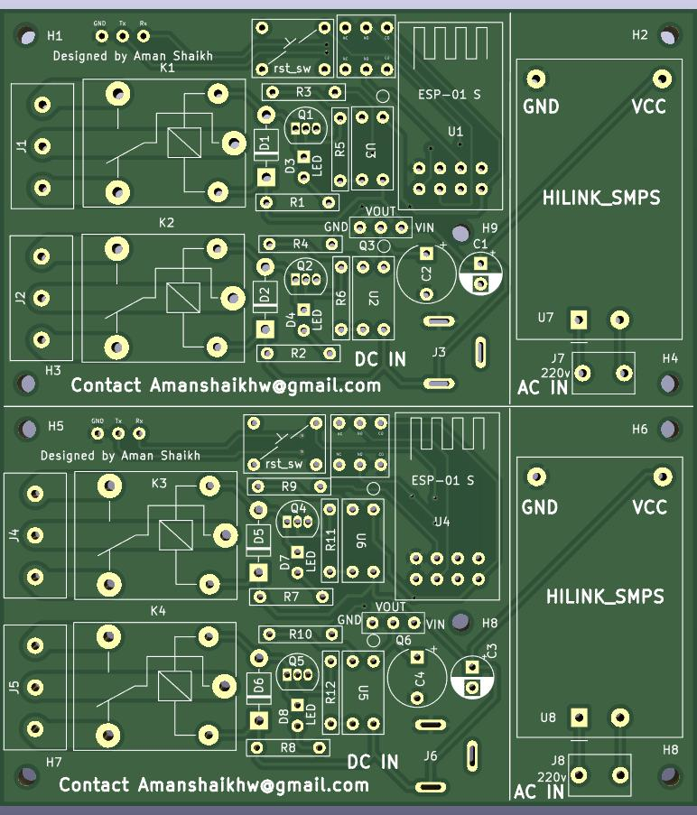
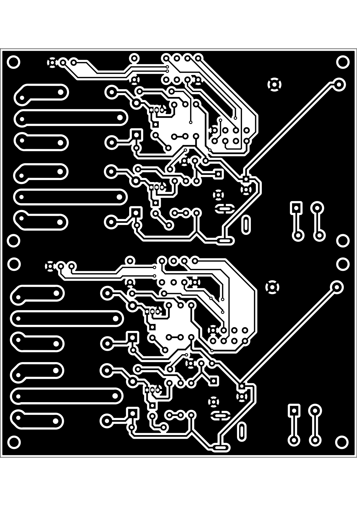
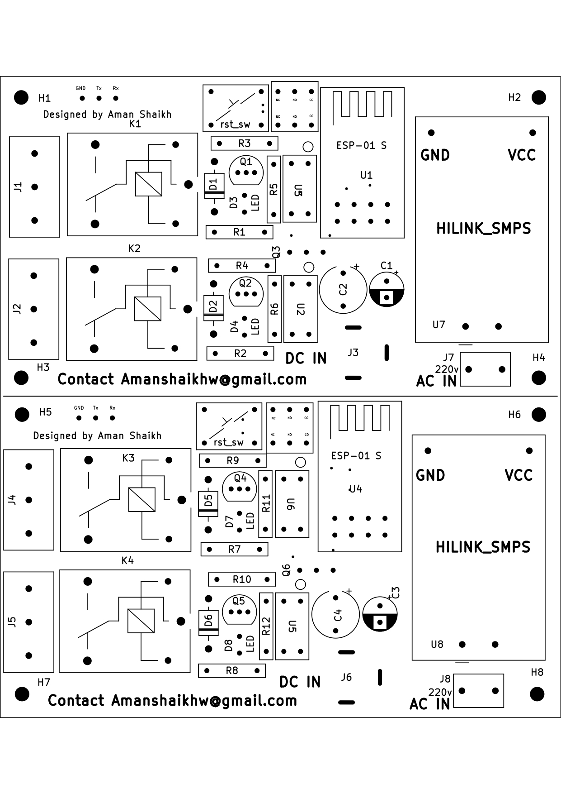

# Esp-01 S Relay Module
This is a esp-01 S low form factor relay module with inbulit power supply.  
## Features of the module:
<ol>
  <li>On board power supply 220V to 12v or 5v as per your need</li>
  <li>Can control Two Relay modules</li>
  <li>supports 12v to 5v relays *(provided that you use an appropitate power supply)</li>
  <li>ON board programming supported via RX and TX communication (Need a usb to ttl converters)</li>
  <li>DC powering as wells as 220V powering supported</li>
  <li>small form factor 4.8cm x 4.2 cm (48.28X42.54 mm)</li>
  <li>4 Mounting holes provided for mounting</li>
</ol>

## Materials required:
<table>
  <tr>
    <th>No.</th>
    <th>Component</th>
    <th>Quantity</th>
  </tr>
  <tr>
    <td>1</td>
    <td>Esp-01 S module</td>
    <td>1</td>
  </tr>
  <tr>
    <td>2</td>
    <td>1000 µF and 100  µF Capacitor</td>
    <td>1</td>
  </tr>
  <tr>
    <td>3</td>
    <td>optocoupler cosmo 1010</td>
    <td>2</td>
  </tr>
  <tr>
    <td>4</td>
    <td>Screw connector 3 pin and 2 pin 5.08mm</td>
    <td>2</td>
  </tr>
   <tr>
    <td>5</td>
    <td>LED 5mm (Any color)</td>
    <td>2</td>
  </tr>
  <tr>
    <td>6</td>
    <td>Push switch</td>
    <td>1</td>
  </tr>
  <tr>
    <td>7</td>
    <td>Push button</td>
    <td>1</td>
  </tr>
  <tr>
    <td>8</td>
    <td>Resistor 1k Ω </td>
    <td>6</td>
  </tr>
  <tr>
    <td>9</td>
    <td>LM1117 3.3v regulator</td>
    <td>1</td>
  </tr>
  <tr>
    <td>10</td>
    <td>Hilink power supply 12v or 5v*</td>
    <td>1</td>
  </tr>
  <tr>
    <td>11</td>
    <td>barrel connector</td>
    <td>1</td>
  </tr>
  <tr>
    <td>12</td>
    <td>Relays 12v or 5v*</td>
    <td>2</td>
  </tr>
  <tr>
    <td>13</td>
    <td>Female Headers</td>
    <td>3</td>
  </tr>
</table>
*Quantity for 1 board the pcb panel consists of two boards  
*While choosing the relays you need to power the board with the same DC voltage or get an smps that will full-fill the needs range supported is between 12v and 5v

   PCB board view
  

  
 

  

  
  
## How to program the esp-01 S with USB to TTL Converters on board:
<ol>
<li>Firstly disconnect any load that is connected to the relay</li>
<li>Now power the board via AC or DC (DC recomended)</li>
<li>connect the Rx of the usb to ttl converted to Tx</li>
  <li>TX of the converter to the Rx</li>
  <li>GND of the converter to GND of the module</li>
  <li>Press the Push Switch once to enter programming mode (a relay will click)</li>
  <li>Then press the reset switch once</li>
  <li>After this you should be able to program the ESP-01 S using the module</li>
  <li>After programming you should Press the push button and reset switch so that ESP-01 S can run the code</li>
</ol>

## How to order:
  <ol>
    <li>Download and extract the git-hub file</li>
    <li>Find the Board Gerbers form the Gerber folder</li>
    <li>Now upload the gerber zip file to you pcb manufacturer (JLCPCB recomended)</li>
    <li>Now you can place the order</li>
   </ol>

## Important guidlines:
<ol>
  <li>

   
Once the pcb arrives then you will need to cut it along the guid which is on the pcb this will give you two coppies of the board
</li>
   <li>
Additionall if you only want to power the board with DC power supply then you can skip mounting the smps and directly power it with the DC jack or else you can cut the hilink smps section of the board (this is optional)
</li>
  

</ol>

## Use cases:
<ol>
<li>Module is well suited for automation systems</li>
<li>Well suited for space constraint areas</li>
<li>Easy to Program and develop solutions that require automation</li>
<li>Provides a cost effective solution</li>
</ol>
